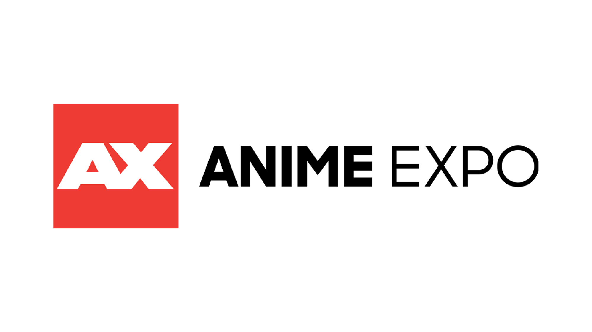

# Proyecto de Java - Anime Expo

### Integrantes: 

#### 1- Juan Felipe Rubio Sanabria
#### 2- Andrés Felipe Portilla Amorocho
#### 3- Jorge Luis Mozo Castro

************

### Introducción:

Anime Expo es el evento de convenciones de anime más grande del mundo, atrayendo a millones de fanáticos del anime y la cultura japonesa. Aunque ha logrado un éxito masivo, enfrenta desafíos significativos en la gestión de eventos simultáneos y globales, lo que limita su capacidad de expansión y visibilidad internacional. Para abordar estos problemas y mejorar la difusión de la cultura del anime, Anime Expo ha decidido desarrollar un software especializado que optimice la gestión de múltiples eventos a nivel mundial, facilitando la planificación, coordinación y administración centralizada.
**********
### Caso de Estudio:

Anime Expo, enfrentando dificultades para gestionar eventos simultáneos en diversas ubicaciones globales, ha lanzado un concurso en colaboración con Campuslands para desarrollar un software integral. Este software debe permitir la planificación centralizada, control de recursos, coordinación de actividades y manejo de participantes en tiempo real. Nuestro equipo ha aceptado el desafío y se compromete a crear una solución que no solo satisfaga las necesidades actuales de Anime Expo, sino que también establezca un nuevo estándar en la gestión de eventos de gran escala. En este documento, detallamos el proceso de planificación, diseño y desarrollo del software, proporcionando una guía para futuros desarrolladores y interesados en la creación de sistemas complejos.

***********
## Patrones arquitectonicos y de diseño

**Tecnologias:**
* MySQL
* Java
*************
**Dependencias:**
* Apache Ant
********
**Librerias:**
* JDBC Driver
********
**Api:**
* Api Stream
********
**Herramientas:**
* Draw.io
* Apache NeatBeans
* Visual Studio Code
* MySQL Worbench
* StarUML
* Notion
* Chagpt
********
**Link de documentación:**

    https://juniper-haze-878.notion.site/The-Anime-Expo-934232860a944e1e9d6f58b901cd3c8a 